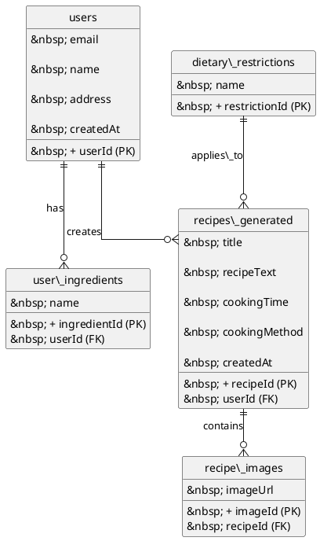
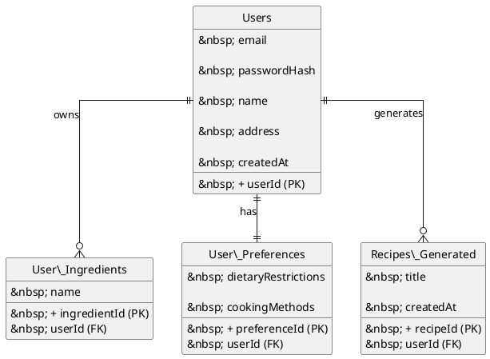

\# Phase 2: AI Chef Recipe Generator – SDLC


\*\*Project By:\*\* Eiad Alsafadi, Oleg Vasiliev, Moied Ahmed


---


\## 1. Project Overview


\*\*Project Name:\*\* AI Chef Recipe Generator  


\*\*Objective:\*\*  

To help users find recipes they can cook with the ingredients they already have, taking into account available cooking methods, time, and dietary restrictions.  


\*\*Target Demographic:\*\*  

\- Home cooks  

\- Food enthusiasts  

\- People with dietary restrictions  


\*\*Platform:\*\*  

\- Web and Mobile application  


---


\## 2. Project Scope


\- Generate recipes using AI based on user inputs  

\- Accept user inputs including:  

&nbsp; - Ingredients (from list, personal additions, or photo recognition)  

&nbsp; - Available cooking time  

&nbsp; - Cooking method (Stove, Microwave, Oven)  

&nbsp; - Dietary restrictions  

\- Provide step-by-step cooking instructions with images  

\- Sign up and sign in using Email/Password or Google  

\- Save user ingredient lists and preferences  

\- Option to generate multiple recipe suggestions  


---


\## 3. SDLC Phases


\### 3.1 Requirement Analysis


\*\*Functional Requirements:\*\*  

\- Sign Up / Sign In functionality with multiple login options  

\- Ingredient selection from generic or personal lists  

\- Cooking time and method selection  

\- Dietary restriction selection  

\- Recipe generation using AI (Gemini API)  

\- Display cooking instructions with images (Sora API)  

\- Address auto-generation via Canada Post API  


\*\*Non-Functional Requirements:\*\*  

\- Fast response time for recipe generation  

\- User-friendly and intuitive UI  

\- Secure login and user data handling  

\- Support remote and distributed development  


\*\*Deliverables: UML\*\*  

\- Use Case Diagram 

```plantuml

@startuml

left to right direction

skinparam packageStyle rectangle


actor User

actor "Gemini AI" as Gemini

actor "Sora API" as Sora

actor "Canada Post API" as CanadaPost


rectangle "AI Chef Recipe Generator" {


&nbsp; User -- (Sign Up)

&nbsp; User -- (Sign In)

&nbsp; User -- (Manage Ingredients)

&nbsp; User -- (Select Dietary Restrictions)

&nbsp; User -- (Select Cooking Time)

&nbsp; User -- (Select Cooking Method)

&nbsp; User -- (Generate Recipe)

&nbsp; User -- (View Recipe)

&nbsp; User -- (Save Recipe)


&nbsp; (Sign Up) --> (Auto-generate Address)

&nbsp; (Auto-generate Address) -- CanadaPost


&nbsp; (Generate Recipe) --> (AI Recipe Generation)

&nbsp; (AI Recipe Generation) -- Gemini


&nbsp; (View Recipe) --> (Generate Cooking Images)

&nbsp; (Generate Cooking Images) -- Sora

}


@enduml

```

\- Firebase Firestore Database ERD Diagram



\- User ERD Diagram 



&nbsp;

---


\### 3.2 System Design: System Architecture


\*\*High-Level Design:\*\*  

\- Client-Server architecture  

\- Frontend: Mobile \& Web interface  

\- Backend: Firebase  

\- Database: Firebase Firestore for user data, ingredients, and recipe history  

\- Authentication: Firebase Auth for Email/Password and Google  


\*\*Low-Level Design:\*\*  

\- Screen Flow (9–10 screens)  

\- API endpoints for recipe generation, image generation, and postal code lookup  

\- Data models for users, ingredients, recipes, and dietary restrictions  


\*\*Data Structure for Integration\*\*  

\- Front-end (Flutter/Dart) → reads/writes from Firestore  

\- Gemini AI → receives ingredients, dietary restrictions, time, cooking method → generates recipeText → save to `recipes\_generated`  

\- Sora API → receives the recipe steps → generates images → store URLs in `recipes\_generated`  

\- Canada Post API → receives postalCode → return address → store URL in `users`  


\*\*Back-end (Firestore Flow)\*\*  

\- User logs in → `users` collection  

\- User selects ingredients → `user\_ingredients`  

\- User selects dietary restrictions → references `dietary\_restrictions`  

\- User clicks “Generate Recipe” → send ingredients, restrictions, time, method to Gemini AI  

\- Gemini AI returns recipe → store in `recipes\_generated`  

\- Sora generates images → store URLs in `recipes\_generated` or separate `recipe\_images`  

\- Frontend displays recipe and images  


---


\### CRUD (Create, Read, Update, Delete Flow)


\*\*Implementation in AI Chef Recipe Generator:\*\*  

\- \*\*Create:\*\* Users can add new ingredients, register accounts, generate recipes → stored in `users`, `user\_ingredients`, `recipes\_generated`  

\- \*\*Read:\*\* Frontend reads data to display ingredients, dietary restrictions, saved recipes, preferences  

\- \*\*Update:\*\* Users update ingredients, dietary restrictions, or saved recipes → Firestore syncs changes  

\- \*\*Delete:\*\* Users remove ingredients, delete saved recipes, or clear preferences  


\_All operations are done via Flutter/Dart using Firestore SDK.\_


---


\### 3.3 Implementation / Coding


\*\*Frontend: Flutter\*\*  

1\. Open App  

2\. Choose Ingredients from collection `user\_ingredients` (e.g., Agave, Anchovies, Avocado, Bacon)  

3\. Choose dietary restriction(s) from collection `dietary\_restrictions` (e.g., Dairy-free)  

4\. Cook Timer (e.g., 1 hour 30 min)  

5\. Select Cooking Method (e.g., Stove and pan)  

6\. Click Get Recipe  

7\. User gets recipes based on inputs  


\*\*Backend: Firebase Database\*\*  

\- AI Integration: Gemini API for recipe generation  

\- Image Integration: Sora API for cooking instructions  

\- Address auto-generation via Canada Post API  

\- Database: Firebase Firestore  

\- Authentication: Firebase Auth (Email/Password, Google)  


---


\### 3.4 Testing


\- Unit Testing: Frontend components, backend APIs, AI calls  

\- Integration Testing: Frontend-backend-AI interaction  

\- Functional Testing: Login, ingredient selection, recipe generation  

\- User Acceptance Testing (UAT): Validating generated recipes  

\- Performance Testing: Recipe generation response times  


---


\### 3.5 Deployment


\- Hosting Platform: Firebase Hosting Cloud Firestore  

\- CI/CD Pipeline: GitHub Actions or equivalent  

\- Monitoring: Firebase Crashlytics or logging tools  


---


\### 3.6 Screens \& User Flow


1\. \*\*Sign In Screen:\*\* Login via Email/Password or Google  

2\. \*\*Sign Up Screen:\*\* Register, postal code auto-generates street info, navigates to Landing Page  

3\. \*\*Landing Page Screen:\*\* Make recipe with ingredients or photo, add new ingredients → leads to Ingredient List Screen  

4\. \*\*Recipe With Ingredients List Screen:\*\* Select ingredients, proceed to Confirm Ingredients Screen  

5\. \*\*Confirming Ingredient List Screen:\*\* Review selected ingredients, remove or add more, proceed to Dietary Restrictions Screen  

6\. \*\*Choosing Dietary Restrictions Screen:\*\* Select restrictions, proceed to Available Cooking Time Screen  

7\. \*\*Choosing Available Cooking Time Screen:\*\* Select cooking time, proceed to Cooking Method Screen  


---


\### 3.7 Task Distribution


| Team Member       | Role \& Responsibilities                   | Key Tasks |

|------------------|------------------------------------------|-----------|

| Eiad Alsafadi     | Backend \& AI Integration                  | Integrate Front-end with Back-end, Gemini API, Sora API, API endpoints, secure API communication |

| Oleg Vasiliev     | Frontend \& UI/UX Design                   | Design UI screens, connect frontend to backend, responsive design, smooth navigation |

| Moied Ahmed       | Database, Integration \& Testing           | Design/manage Firebase DB, implement Firebase Auth, conduct unit/integration/UAT testing, document SDLC updates |


---


\*\*END OF DELIVERABLE DOCUMENT\*\*


